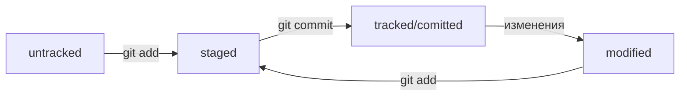

# **Шпаргалка по Git**

# **Git - что это?**

Git - это быстрая, масштабируемая, распределенная система управления версиями с необычно богатым набором команд, который обеспечивает как высокоуровневые операции, так и полный доступ к внутренним компонентам.

Git - это проект с открытым исходным кодом. Первоначально он был написан Линусом Торвальдсом с помощью группы хакеров по всей сети. 

Само название "git" создатель объяснил тем, что описал инструмент как "глупый трекер контента", а название как (в зависимости от вашего настроения):

* случайная комбинация из трех букв, которая произносится и на самом деле не используется какой-либо общей командой UNIX. Тот факт, что это неправильное произношение "get" может быть или не быть актуальным.
* stupid. contemptible and despicable. simple. Выберайте на свой вкус.
"глобальный информационный трекер" (global information tracker): вы в хорошем настроении, и это действительно работает для вас. Ангелы поют, и свет внезапно заполняет комнату.
* "чертов идиотский грузовик дерьма" (goddamn idiotic truckload of sh*t): когда он ломается

# **Список команд:**

## **1. Работа  с репозиторием**

```
$ cd ~/dev/first-project # перешли в нужную папку
$ git init # создали репозиторий
$ cd <папка с репозиторием> # перешли в папку
$ rm -rf .git # удалили подпапку .git
$ touch todo.rtf
$ touch readme.rtf
# создали файлы todo.rtf и readme.rtf
$ git status # проверили статус
$ git add --all # подготовили к сохранению все файлы в репозитории
$ git status # проверили статус
```

Файлы, которые отмечены зелёным, теперь отслеживаются и готовы к сохранению. Но сохранения пока не произошло, потому что команда `git` add только запоминает текущее содержимое (контент) файла.

Если сейчас отредактировать любой из «зелёных» файлов в папке `first-project`, он перейдёт в состояние `modified` (англ. «изменённый») и будет и в «зелёном», и в «красном» списках. 

Например, откройте файл `todo.rtf` в любом редакторе (подойдёт даже блокнот) и напишите в нём: `1. Пройти пару уроков по Git.`.

Сохраните изменения, а затем снова вызовите команду `git status` в консоли.

Файл `todo.rtf` теперь есть и в «зелёном», и в «красном» списках:

*зелёным отмечена пустая версия файла — в таком виде он был во время последнего запуска команды git add;
*красным отмечена версия с текстом `1. Пройти пару уроков по Git.`.

Чтобы запомнить новое состояние файла, нужно снова ввести команду `git add` и передать в качестве параметра имя изменённого файла или ключ `--all`.

```
$ git add todo.rtf
# или
$ git add --all
```
Теперь файл `todo.rtf` снова готов к сохранению! Будет сохранена последняя добавленная версия с текстом `1. Пройти пару уроков по Git.`.

## **2. Работа с коммитом**

**Коммит** — это одна из основных сущностей в Git (и в других системах контроля версий). Коммит гарантирует, что изменения будут сохранены в истории и при необходимости к ним можно будет «откатиться». Это как если бы вы могли выполнить операцию `Ctrl+Z` для целой папки (репозитория).

```
$ git commit -m 'Мой первый коммит!'
```
где ключ `-m` позволяет присвоить коммиту сообщение. Помните, что такие сообщения должны быть информативными: чётко описывать изменения.

Для просмотра истории коммитов — `git log`. По умолчанию `git log` выводит коммиты в обратном хронологическом порядке — последние коммиты оказываются первыми сверху. В этом можно убедиться, если посмотреть на дату и время их создания.

# **Git и платформы для удалённой работы**

_Нужно помнить, что Git и GitHub — это два разных проекта, которые развиваются независимо друг от друга_. 

Git:
- консольный инструмент для работы с локальными и удалёнными репозиториями;
- проект с открытым исходным кодом.

GitHub:
- платформа для размещения удалённых репозиториев;
- принадлежит компании Microsoft.

## **Привязать удалённый репозиторий к локальному** 

Перейдите на страницу удалённого репозитория, выберите тип `SSH` и скопируйте `URL`. Кнопка справа позволит сделать это мгновенно.

Откройте консоль, перейдите в каталог локального репозитория и введите команду `git remote add` (от англ. _remote_ — «удалённый» и _add_ — «добавить»). 

```
$ cd ~/dev/first-project
$ git remote add origin git@github.com:%ИМЯ_АККАУНТА%/first-project.git
```

Команде необходимо передать два параметра: имя удалённого репозитория и его URL. В качестве имени используйте слово `origin`. А URL вы скопировали со страницы удалённого репозитория.

`origin` (англ. «источник») — стандартный псевдоним, с помощью которого можно обращаться к главному удалённому репозиторию (обычно такой репозиторий один). Это значительно упрощает работу.

## **Убедиться, что репозитории связаны**

```
$ git remote -v
origin    git@github.com:%ИМЯ_АККАУНТА%/%ИМЯ-ПРОЕКТА%.git (fetch)
origin    git@github.com:%ИМЯ_АККАУНТА%/%ИМЯ-ПРОЕКТА%.git (push)
```
где флаг `-v` — короткая форма флага `--verbose` (англ. «подробный»). Он позволяет показать больше информации в выводе.

## **Синхронизация репозиториев**

```
$ git push -u origin main # загрузить содержимое локального репозитория на GitHub.
```
При этом во время взаимодействия с удалёнными репозиториями Git выводит в консоль отладочную информацию: количество объектов (файлов), которые отправляются на сервер, информацию о прогрессе сжатия и записи и так далее.

## **Файл README.md**

Чтобы другие пользователи, а также потенциальные клиенты или работодатели могли понять, что представляет собой проект, его нужно описать. Такое описание принято указывать в файле `README.md` (от англ. read — «прочитай» и me — «меня»).

Как правило, в `README.md` проекта можно найти следующую информацию:

* Название проекта и его краткое описание: кем создан, для чего, какие решает задачи и какие закрывает проблемы.
* Технологии, которые применяются в проекте. В чём его отличие от аналогичных.
* Документация проекта — подробная инструкция о том, что представляет собой проект.
* Планы проекта, если они есть.

_Кстати, это **текстовый файл**, который можно создать командой `touch`, а затем редактировать так же, как и любой другой текстовый документ. Например, в Visual Studio Code._

Полезные ссылки по базовому синтаксису маркдауна:

[https://www.markdownguide.org/cheat-sheet/]: На английском
[https://gist.github.com/fomvasss/8dd8cd7f88c67a4e3727f9d39224a84c]:  На русском

Загружаем получившийся репозиторий на GitHub. Не забываем проверить, что локальная и удалённая версии идентичны.


# **Навигация по коммитам. Статусы файлов**

## **Хеш - идентификатор коммита**


**Хеширование** (от англ. hash, «рубить», «крошить», «мешанина») — это способ преобразовать набор данных и получить их «отпечаток» (англ. fingerprint).

Информация о коммите — это набор данных: когда был сделан коммит, содержимое файлов в репозитории на момент коммита и ссылка на предыдущий, или **родительский** (англ. parent), коммит.

Git хеширует (преобразует) информацию о коммите с помощью алгоритма SHA-1 (от англ. Secure Hash Algorithm — «безопасный алгоритм хеширования») и получает для каждого коммита свой уникальный хеш — результат хеширования.

Обычно хеш — это короткая (40 символов в случае SHA-1) строка, которая состоит из цифр `0—9` и латинских букв `A—F` (неважно, заглавных или строчных). Она обладает следующими важными свойствами:
* если хеш получить дважды для одного и того же набора входных данных, то результат будет гарантированно одинаковый;
* если хоть что-то в исходных данных поменяется (хотя бы один символ), то хеш тоже изменится (причём сильно).

Git хранит таблицу соответствий `хеш → информация о коммите`. Если вы знаете хеш, вы можете узнать всё остальное: автора и дату коммита и содержимое закоммиченных файлов. Можно сказать, что хеш — основной идентификатор коммита.

При работе с Git хеши будут встречаться вам регулярно. Их можно будет передавать в качестве параметра разным Git-командам, чтобы указать, с каким коммитом нужно произвести то или иное действие.

Все хеши и таблицу `хеш → информация о коммите` Git сохраняет в служебные файлы. Они находятся в скрытой папке ``.git`` в репозитории проекта.


##  **Исследуем лог**

**Лог** (от англ. log — «журнал [записей]») полезен, если нужно быстро найти нужный коммит среди сотни других. После вызова `git log` появляется список коммитов.

Разберём элементы, из которых состоит описание:

* строка из цифр и латинских букв после слова commit — это хеш коммита;
* **Author** — имя автора и его электронная почта;
* **Date** — дата и время создания коммита;
* в конце находится сообщение коммита.

Исходный код самого Git тоже хранится в Git-репозитории (тут уместно вспомнить про курицу и яйцо). Вот так выглядит описание самого первого коммита в репозитории Git: 

```
commit e83c5163316f89bfbde7d9ab23ca2e25604af290
Author: Linus Torvalds <torvalds@linux-foundation.org>
Date:   Thu Apr 7 15:13:13 2005 -0700

    Initial revision of "git", the information manager from hell
```

Получить сокращённый лог можно с помощью команды `git log` с флагом `--oneline` (англ. «одной строкой»). В терминале появятся только первые несколько символов хеша каждого коммита и их комментарии.

Сокращённый лог полезен, если в репозитории уже много коммитов — например, сотни или тысячи. В этом случае можно быстро найти нужный по описанию.

Сокращённый хеш (то есть первые несколько символов полного) можно использовать точно так же, как и полный. Для этого команда `git log --oneline` автоматически подбирает такую длину сокращённых хешей, чтобы они были уникальными в пределах репозитория и Git всегда мог понять, о каком коммите идёт речь.


## **HEAD — всему голова**

Файл `HEAD` (англ. «голова», «головной») — один из служебных файлов папки ``.git.`` Он указывает на коммит, который сделан последним (то есть на самый новый).
В этом можно убедиться с помощью терминала:

```
$ pwd # посмотрели, где мы
/Users/user/dev/first-project

$ cd .git/
$ ls # посмотрели, какие есть файлы
COMMIT_EDITMSG  ORIG_HEAD  description  index  logs/     refs/
HEAD            config     hooks/       info/  objects/

$ cat HEAD # команда cat показывает содержимое файла
ref: refs/heads/master # в файле вот такая ссылка
```

Внутри `HEAD` — ссылка на служебный файл: `refs/heads/master` (или refs/heads/main в зависимости от названия ветки). Если заглянуть в этот файл, можно увидеть хеш последнего коммита.

```
$ cat refs/heads/master # взяли ссылку из файла HEAD
# внутри хеш
e007f5035f113f9abca78fe2149c593959da5eb7

$ git log 
# сверяем с хешем последнего коммита
commit e007f5035f113f9abca78fe2149c593959da5eb7
Author: John Doe <johndoe@example.com>
Date:   Tue Mar 28 00:26:53 2023 +0300

    Добавить амбиций в список дел

... # другие коммиты
```

Когда вы делаете коммит, Git обновляет `refs/heads/master` — записывает в него хеш последнего коммита. Получается, что `HEAD` тоже обновляется, так как ссылается на `refs/heads/master`.

При работе с Git указатель `HEAD` используется довольно часто. Если нужно передать последний коммит, то вместо его хеша можно просто написать слово `HEAD` — Git поймёт, что вы имели в виду последний коммит.


## **Статусы файлов в Git**

До появления Git системы контроля версий выделяли только два статуса у файлов: «уже закоммичен» и «ещё не закоммичен». Например, в Subversion (самой популярной VCS до эпохи Git) не нужно было выполнять команду — аналог `git add`, а можно было просто сделать коммит (svn commit). Эта команда по умолчанию добавляла в коммит все новые и изменённые файлы.
Такое поведение интуитивно более понятно. Зато Git даёт больше контроля за состоянием файлов. Хотя сначала это может показаться сложным, со временем вы оцените удобство более явного подхода.

### **Статусы `untracked`/`tracked`, `staged` и `modified`**

Одна из ключевых задач Git — отслеживать изменения файлов в репозитории. Для этого каждый файл помечается каким-либо статусом. Рассмотрим основные:

* `untracked` (англ. «неотслеживаемый») 

 Мы говорили, что новые файлы в Git-репозитории помечаются как untracked, то есть неотслеживаемые. Git «видит», что такой файл существует, но не следит за изменениями в нём. У `untracked`-файла нет предыдущих версий, зафиксированных в коммитах или через команду `git add`. 

* `staged` (англ. «подготовленный»)

  После выполнения команды `git add` файл попадает в **staging area** (от англ. stage — «сцена», «этап [процесса]» и area — «область»), то есть в список файлов, которые войдут в коммит. В этот момент файл находится в состоянии `staged`.

* `tracked` (англ. «отслеживаемый») 

 Состояние `tracked` — это противоположность untracked. Оно довольно широкое по смыслу: в него попадают файлы, которые уже были зафиксированы с помощью `git commit`, а также файлы, которые были добавлены в staging area командой `git add`. То есть все файлы, в которых Git так или иначе отслеживает изменения. 

* `modified` (англ. «изменённый») 

 Состояние `modified` означает, что Git сравнил содержимое файла с последней сохранённой версией и нашёл отличия. Например, файл был закоммичен и после этого изменён.


 ### **Про `staged` и `modified`**

 Команда `git add` добавляет в staging area только текущее содержимое файла. Если вы, например, сделаете `git add file.txt`, а затем измените `file.txt`, то новое содержимое файла не будет находиться в staging.

Git сообщит об этом с помощью статуса `modified`: файл изменён относительно той версии, которая уже в staging. Чтобы добавить в staging последнюю версию, нужно выполнить `git add file.txt` ещё раз.

### **Типичный жизненный цикл файла в Git**

Может показаться, что файлы в репозитории попадают в разные состояния хаотично. На практике это не так, и у большинства файлов вполне предсказуемый путь:




1. Файл только что создали. Git ещё не отслеживает содержимое этого файла. Состояние: `untracked`.

2. Файл добавили в staging area с помощью git add. Состояние: `staged` (+ `tracked`). 

 *  Возможно, изменили файл ещё раз. Состояния: `staged`, `modified` (+ `tracked`).
 * Bнимание: staged и modified у одного файла, но у разных его версий. 
 * Ещё раз выполнили `git add`. Состояние: `staged` (+ `tracked`).

3. Сделали коммит с помощью `git commit`. Состояние: `tracked`.

4. Изменили файл. Состояние: `modified` (+ `tracked`).

5. Снова добавили в staging area с помощью `git add`. Состояния: `staged` (+ `tracked`).

6. Сделали коммит. Состояния: `tracked`.

7. Повторили пункты 4−7 много-много раз.